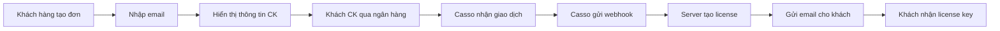

# 🏦 Hướng Dẫn Cấu Hình Casso Payment

## 📋 Thông Tin Casso

Bạn đã cung cấp:
- **Business ID**: `4bbbd884-88f2-410c-9dc8-6782980ef64f`
- **API Key**: `dd9f4ba8-cc6b-46e8-9afb-930972bf7531`
- **Checksum Key**: `a1e68d7351f461fa646a0fbd8f20563bcfb8080c44d50eb54df2f9ed9a0bfd7d`

---

## ⚙️ Bước 1: Setup Environment Variables trên Render

1. **Vào Render Dashboard** → Chọn service `ocr-license-server`

2. **Vào tab Environment**

3. **Thêm 3 biến môi trường**:

```
CASSO_BUSINESS_ID = 4bbbd884-88f2-410c-9dc8-6782980ef64f
CASSO_API_KEY = dd9f4ba8-cc6b-46e8-9afb-930972bf7531
CASSO_CHECKSUM_KEY = a1e68d7351f461fa646a0fbd8f20563bcfb8080c44d50eb54df2f9ed9a0bfd7d
```

4. **Click "Save Changes"** → Render sẽ tự động redeploy

---

## 🔔 Bước 2: Setup Webhook trên Casso.vn

1. **Đăng nhập vào Casso.vn**

2. **Vào phần "Cài đặt" hoặc "Settings"**

3. **Tìm mục "Webhook" hoặc "Thông báo tự động"**

4. **Thêm Webhook URL**:
   ```
   https://ocr-uufr.onrender.com/api/webhook/casso
   ```

5. **Chọn sự kiện**: 
   - ✅ **Transaction Created** (Khi có giao dịch mới)
   - hoặc tương tự

6. **Lưu lại**

---

## 🧪 Bước 3: Test Webhook

### **Cách 1: Test Manual với API**

```bash
curl -X POST https://ocr-uufr.onrender.com/api/casso/test-webhook \
  -H "Content-Type: application/json" \
  -H "X-Admin-Key: your-secure-admin-api-key-here-change-this" \
  -d '{
    "email": "test@example.com",
    "amount": 100000,
    "transaction_id": "TEST12345"
  }'
```

**Kết quả mong đợi**:
```json
{
  "success": true,
  "order_id": "ORD20251022XXXXX",
  "license_key": "XXXX-XXXX-XXXX-XXXX"
}
```

### **Cách 2: Test Thật với Chuyển Khoản**

1. **Tạo đơn hàng** từ website:
   - Vào https://ocr-uufr.onrender.com
   - Click "Mua Ngay"
   - Nhập email: `youremail@example.com`
   - Click "Tạo Đơn Hàng"

2. **Chuyển khoản**:
   - Số tiền: **100,000 VND**
   - Nội dung: **youremail@example.com** (chính xác email bạn nhập)

3. **Đợi 1-2 phút**

4. **Check email** → Bạn sẽ nhận được License Key!

---

## 🔍 Kiểm Tra Logs

### **Trên Render**:

Vào **Logs** tab, bạn sẽ thấy:

```
📩 Received Casso webhook: {'id': 'TXN123', 'amount': 100000, ...}
✅ Successfully processed Casso payment: TXN123
   Email: customer@example.com
   License: ABCD-1234-EFGH-5678
✅ Email sent to customer@example.com via SMTP1
```

---

## 🎯 Workflow Tự Động



---

## 📊 API Endpoints

### **1. Tạo Đơn Hàng**
```
POST /api/payment/create-order
Body: {
  "customer_email": "email@example.com",
  "plan_type": "lifetime",
  "amount": 100000
}
```

### **2. Webhook Nhận Thanh Toán** (Casso gọi)
```
POST /api/webhook/casso
Body: {
  "id": "TXN123",
  "amount": 100000,
  "description": "email@example.com",
  "when": "2025-10-22 11:30:00"
}
```

### **3. Test Webhook** (Admin only)
```
POST /api/casso/test-webhook
Headers: {
  "X-Admin-Key": "your-admin-key"
}
Body: {
  "email": "test@example.com",
  "amount": 100000,
  "transaction_id": "TEST123"
}
```

---

## ⚠️ Lưu Ý Quan Trọng

### **1. Khách hàng PHẢI ghi email vào nội dung CK**

Hệ thống sẽ tìm email trong nội dung chuyển khoản để:
- Match với đơn hàng
- Gửi license key về đúng email

**Ví dụ nội dung CK hợp lệ**:
- ✅ `customer@gmail.com`
- ✅ `EMAIL customer@gmail.com`
- ✅ `Mua license customer@gmail.com`
- ❌ `Mua license` (không có email)

### **2. Số tiền chính xác**

Hệ thống chỉ accept giao dịch **ĐÚNG 100,000 VND**.

### **3. Webhook URL phải public**

Render free tier có public URL nên OK. Casso sẽ gửi POST request đến URL này.

### **4. Email configuration**

Để gửi email tự động, cần setup:
- `SMTP_HOST`
- `SMTP_PORT`
- `SMTP_USER_1`, `SMTP_PASSWORD_1`
- `SMTP_USER_2`, `SMTP_PASSWORD_2`

Xem hướng dẫn trong `EMAIL_SETUP.md`

---

## 🐛 Troubleshooting

### **❌ Không nhận được webhook**

1. Check Casso dashboard → "Lịch sử webhook"
2. Xem có lỗi gì không
3. Check Render logs xem có request đến không

### **❌ License không được tạo**

1. Check Render logs xem lỗi gì
2. Verify email có trong nội dung CK không
3. Verify amount = 100,000

### **❌ Không nhận được email**

1. Check email config đã setup chưa
2. Check spam folder
3. Check Render logs xem email có được gửi không

---

## 📞 Support

Nếu cần hỗ trợ:
- Check logs trên Render
- Check webhook history trên Casso
- Contact: support@ocrvietnamese.com

---

## 🎉 Done!

Sau khi setup xong:
1. ✅ Khách vào web → nhập email → xem thông tin CK
2. ✅ Khách CK qua ngân hàng với email trong nội dung
3. ✅ Hệ thống tự động tạo license và gửi email
4. ✅ Khách nhận license key ngay lập tức!

**Hoàn toàn tự động! 🚀**

